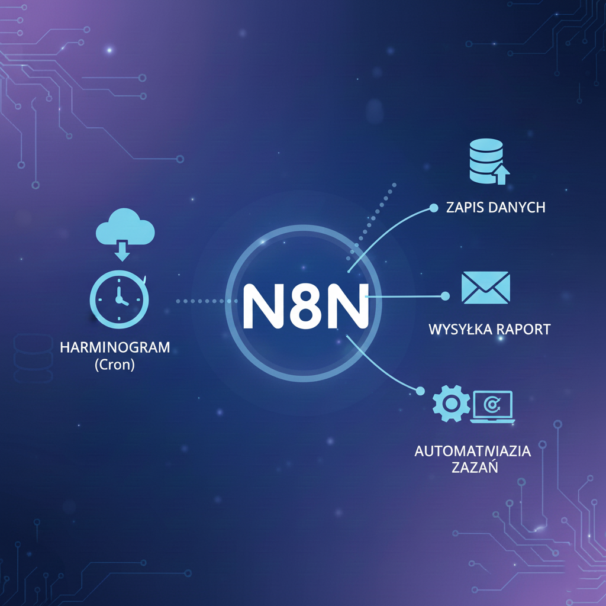

# Utworzenie funkcji harmonogramu (Cron)

---

## Harmonogram (Cron) w n8n – wyjaśnienie

W n8n harmonogram (Cron) pozwala automatycznie uruchamiać workflow w określonych odstępach czasu – np. codziennie, co godzinę, w wybrane dni tygodnia lub miesiąca. Dzięki temu możesz zautomatyzować cykliczne zadania bez ręcznego uruchamiania.

### Jak to działa w n8n?
- Używasz node'a **Schedule** (lub **Cron**), który jest punktem startowym workflow.
- W node'cie ustawiasz regułę Cron, np. `0 8 * * 1-5` (każdy dzień roboczy o 8:00).
- Po wyzwoleniu node Schedule uruchamia kolejne kroki workflow – np. pobranie danych, wysłanie raportu, synchronizację z API.

#### Przykłady zastosowań:
- Codzienne pobieranie danych z zewnętrznego serwisu i zapisywanie do bazy.
- Automatyczne wysyłanie raportów sprzedażowych co poniedziałek.
- Regularne sprawdzanie statusu systemów i powiadamianie zespołu na Slacku.

#### Zalety:
- Pełna automatyzacja cyklicznych procesów.
- Elastyczność – możesz ustawić dowolny harmonogram.
- Integracja z dowolnymi node'ami n8n (API, e-mail, komunikatory, bazy danych).

---

**Podsumowanie:**  
Node harmonogramu (Cron) w n8n to kluczowy element do budowy automatyzacji, które mają działać regularnie i bez udziału człowieka. Pozwala na precyzyjne planowanie i uruchamianie workflow w dowolnych odstępach czasu.

