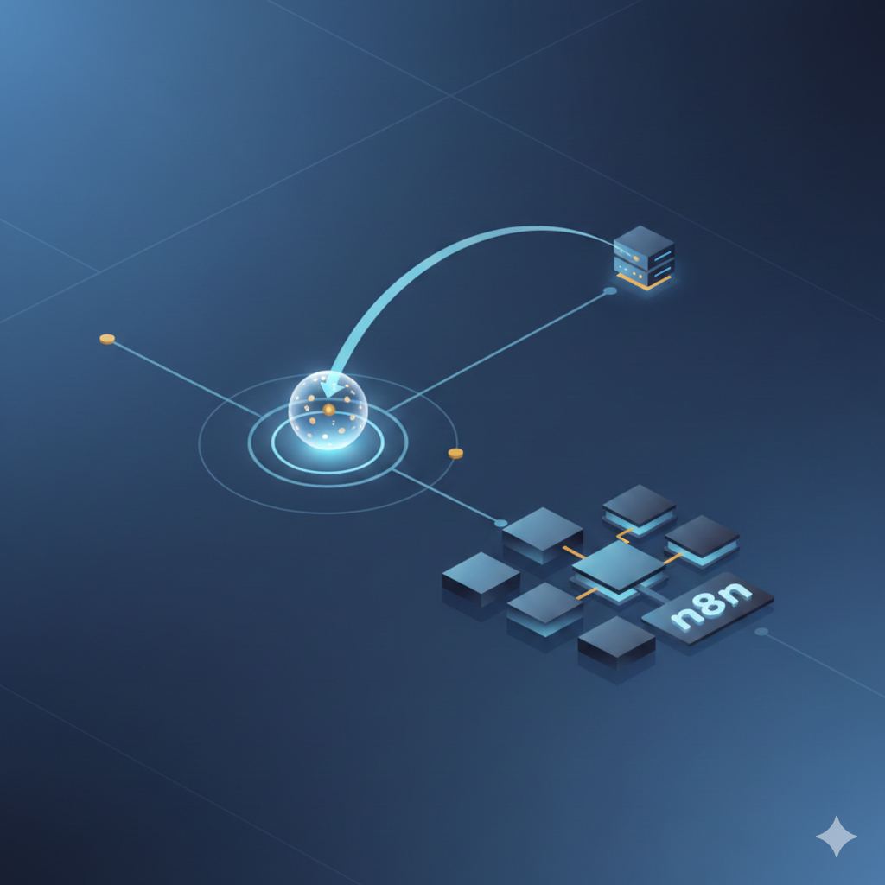

# Webhook w n8n

Webhook to jeden z najpotężniejszych i najczęściej używanych mechanizmów w automatyzacji. Zrozumienie jego działania otwiera drzwi do nieograniczonych możliwości integracji.

---

## Czym jest webhook?

Webhook to endpoint HTTP (unikalny adres URL), który odbiera dane wysyłane z zewnętrznych źródeł w czasie rzeczywistym. To jak "odbiornik" czekający na wiadomości z zewnątrz.

**Prosta analogia:**
Wyobraź sobie skrzynkę pocztową z konkretnym adresem. Każdy, kto zna ten adres, może wysłać do niej list. Webhook działa podobnie – to adres, na który inne aplikacje mogą wysyłać dane.

**Technicznie:**
- Webhook = URL endpoint w Twojej aplikacji (n8n)
- Zewnętrzny serwis wysyła żądanie HTTP POST na ten URL
- Twoja aplikacja otrzymuje dane i może je przetworzyć

---

## Jak działa webhook?

### **Tradycyjne API vs Webhook**

**Tradycyjne API (polling):**
```
Twoja aplikacja: "Hej API, masz coś dla mnie?"
API: "Nie."
[5 sekund później]
Twoja aplikacja: "Hej API, masz coś dla mnie?"
API: "Nie."
[5 sekund później]
Twoja aplikacja: "Hej API, masz coś dla mnie?"
API: "Tak! Oto dane."
```
Musisz ciągle pytać, czy są nowe dane. To nieefektywne.

**Webhook (push):**
```
Webhook: [czeka cicho]
API: "Hej! Mam nowe dane dla Ciebie!" [wysyła dane na webhook]
Webhook: "Dzięki! Zaczynam przetwarzanie."
```
API samo przesyła dane, gdy coś się wydarzy. Efektywne i w czasie rzeczywistym.

---

## Rola webhooka w n8n

W n8n webhook pełni kluczową rolę jako **trigger** – punkt startowy workflow.

### **Webhook jako trigger:**

1. **Tworzysz node Webhook** w workflow
2. **n8n generuje unikalny URL** (np. `https://twoj-n8n.com/webhook/abc123`)
3. **Konfigurujesz zewnętrzny serwis**, aby wysyłał dane na ten URL
4. **Gdy dane dotrą, workflow się uruchamia** automatycznie

---

## Do czego służy webhook?

### **1. Formularze kontaktowe**
Gdy ktoś wypełni formularz na stronie:
```
Formularz → Webhook → n8n → Google Sheets + Email + Slack
```

### **2. Systemy zgłoszeń**
Nowe zgłoszenie od klienta:
```
System → Webhook → n8n → CRM + Powiadomienie + Ticket
```

### **3. Powiadomienia z innych aplikacji**
GitHub, Stripe, Shopify, WordPress – setki usług obsługuje webhooki:
```
GitHub (nowy commit) → Webhook → n8n → Slack (powiadomienie zespołu)
```

### **4. Integracja między systemami**
Połączenie dwóch aplikacji, które same nie potrafią się komunikować:
```
System A → Webhook → n8n → System B
```

### **5. Automatyzacja procesów biznesowych**
```
E-commerce (nowe zamówienie) → Webhook → n8n → 
  → Aktualizacja magazynu
  → Wysyłka faktury
  → Powiadomienie do zespołu
```

---

## Typy webhooków w n8n

### **1. Production Webhook**
- Stały, unikalny URL
- Używany w środowisku produkcyjnym
- Workflow musi być aktywny (włączony)
- Dane są przetwarzane automatycznie

### **2. Test Webhook**
- Tymczasowy URL do testowania
- Używany podczas budowy workflow
- Ważny tylko podczas sesji testowej
- Pozwala zobaczyć, jakie dane przychodzą

---

## Jak stworzyć webhook w n8n?

### **Krok 1: Dodaj node Webhook**
1. W workflow kliknij "+"
2. Wybierz **Webhook** (Trigger)
3. Ustaw metodę HTTP (najczęściej **POST**)
4. Opcjonalnie: ustaw własną ścieżkę (np. `/kontakt`)

### **Krok 2: Skopiuj URL**
n8n wygeneruje URL, np.:
```
https://twoj-n8n.com/webhook/a1b2c3d4-e5f6-7890-abcd-ef1234567890
```

### **Krok 3: Skonfiguruj źródło danych**
W zewnętrznej aplikacji (formularz, CRM, inna usługa):
- Znajdź opcję "Webhook" lub "Integration"
- Wklej skopiowany URL
- Ustaw metodę: POST
- Zapisz

### **Krok 4: Testuj**
1. W n8n kliknij **"Listen for Test Webhook"**
2. Wyślij testowe dane z zewnętrznej aplikacji
3. Zobaczysz dane w n8n
4. Buduj dalszą część workflow

---

## Przykład: formularz kontaktowy

**Formularz HTML:**
```html
<form action="https://twoj-n8n.com/webhook/abc123" method="POST">
  <input name="name" placeholder="Imię" required>
  <input name="email" type="email" placeholder="Email" required>
  <textarea name="message" placeholder="Wiadomość" required></textarea>
  <button type="submit">Wyślij</button>
</form>
```

**Workflow w n8n:**
```
Webhook (odbiera dane)
  ↓
Set (formatuje dane)
  ↓
Google Sheets (zapisuje zgłoszenie)
  ↓
Discord (powiadomienie do zespołu)
  ↓
HTTP Request (odpowiedź do użytkownika: "Dziękujemy!")
```

**Dane otrzymane przez webhook:**
```json
{
  "body": {
    "name": "Jan Kowalski",
    "email": "jan@example.com",
    "message": "Chciałbym uzyskać więcej informacji..."
  }
}
```

---

## Bezpieczeństwo webhooków

### **1. Używaj HTTPS**
Zawsze korzystaj z szyfrowanego połączenia (https://).

### **2. Weryfikuj źródło**
Niektóre usługi wysyłają sygnaturę lub token weryfikacyjny:
```
X-Signature: abc123...
```
Możesz sprawdzić to w node'dzie Function.

### **3. Ukryj URL**
Nie publikuj URL webhooka publicznie – traktuj go jak hasło.

### **4. Waliduj dane**
Sprawdzaj, czy otrzymane dane są poprawne, zanim je przetworzysz.

---

## Debugowanie webhooków

### Problem: Webhook nie odbiera danych
Sprawdź, czy workflow jest aktywny (włączony)
Sprawdź URL – czy jest poprawnie wklejony w zewnętrznej aplikacji
Sprawdź metodę HTTP (POST/GET)
Sprawdź logi serwera n8n

### Problem: Dane przychodzą, ale są puste
Sprawdź format danych (JSON, form-data, XML)
Sprawdź nagłówek Content-Type
Zobacz, co faktycznie przychodzi w Input node'a Webhook

### Narzędzia pomocnicze:
- Postman – wysyłanie testowych żądań HTTP
- curl – testowanie z linii komend
- webhook.site – inspekcja przychodzących danych

---

## Zalety webhooków

Reakcja w czasie rzeczywistym – dane są przetwarzane natychmiast
Efektywność – nie musisz ciągle odpytywać API (polling)
Uniwersalność – prawie każda usługa obsługuje webhooki
Prostota – łatwa konfiguracja, nie wymaga programowania
Skalowalność – możesz obsługiwać tysiące zdarzeń

---

## Wady webhooków

Wymaga publicznego URL – n8n musi być dostępny z internetu
Bezpieczeństwo – musisz chronić endpoint przed nadużyciami
Brak gwarancji dostarczenia – jeśli serwer n8n jest wyłączony, dane mogą zostać utracone
Debugowanie – trudniej testować niż scheduled workflows

---

## Kiedy używać webhooka?

Gdy potrzebujesz reakcji w czasie rzeczywistym
Gdy integrujesz usługi, które wysyłają powiadomienia
Gdy budujesz API endpoint dla zewnętrznych aplikacji
Gdy łączysz formularze, systemy zgłoszeń, e-commerce

**Nie używaj webhooka, gdy:**
Chcesz regularnie odpytywać API (użyj Schedule Trigger)
Źródło danych nie obsługuje webhooków (użyj HTTP Request w pętli)

---

## Podsumowanie

Webhook to fundamentalny mechanizm w automatyzacji i integracji. W n8n pełni rolę **triggera w czasie rzeczywistym**, który odbiera dane z zewnętrznych źródeł i uruchamia workflow.

**Zapamiętaj:**
- Webhook = URL endpoint odbierający dane
- Działa na zasadzie "push" (usługa wysyła dane sama)
- To najczęstszy sposób integracji aplikacji webowych
- Umożliwia budowanie zaawansowanych automatyzacji bez programowania

Teraz możesz tworzyć workflow, które reagują natychmiast na wydarzenia w innych systemach – formularze, zgłoszenia, zamówienia, powiadomienia i wiele więcej!
